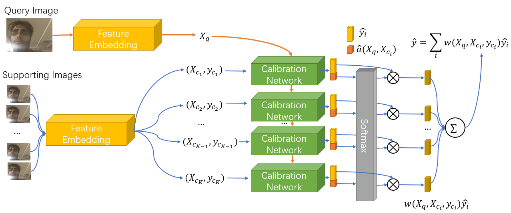
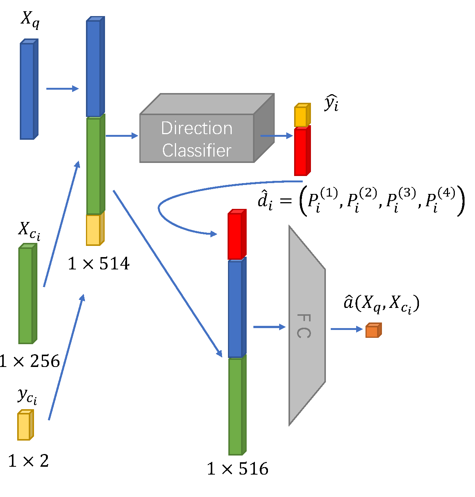

# 2D-gaze-estimate-with-calibration

基于AFF-Net和少样本学习实现的注视点估计。

近年来，由于不断提高的精度和较强的泛化性能，基于卷积神经网络的深度学习方法，在眼动追踪中得到了广泛利用。这些方法将人脸和眼睛图像作为输入，直接学习从输入到注视点的映射关系，区别于传统的基于模型方法，我们将这些神经网络统称为基于外观的视线估计网络。这些眼动追踪方法可以分为2D眼动追踪和3D眼动追踪两种。其中，2D眼动追踪将输入图像映射到视平面（通常为摄像头法线所垂直于的平面）上的2D注视点，而3D眼动追踪则主要考虑视线角度向量。视线向量平行于瞳孔中心点与注视点之间的连线，可以用来表示视线方向。如图1所示的AFF-Net[1]在GazeCapture等数据集的2D视线估计任务中取得了优秀的效果。在我们的校准模型里，AFF-Net被用作从面部图像中特征提取的主干网络，删去最后的全连接层，结合预处理好的左右眼图像、面部图像以及面部网格的数据推理得到256维的特征嵌入。

参考有监督少样本个性化方法[2]，校准网络则将待推理的查询图像特征嵌入和用于校准的支持图像特征嵌入及其对应的校准点坐标进行计算，得到基于支持集中每张图像得到的注视点坐标预测和权重。基于少样本学习的校准模型可以直接根据查询样本和校准数据的关系进行推理，无需即时的训练。此外，由于最后的加权汇聚层中无参数化的网络结构，此模型可以设置任意数量的校准点进行计算。

将每个用户的校准点数量记为 $K$，首先使用由同一用户的查询图像-注视点对和 $K$ 对相应的校准图像-注视点对组成的随机生成的训练样本，来构建训练数据集，用以进行校准网络的训练。如图2所示，校准网络的模型如下：首先，将待预测的查询图像和所有校准图像输入特征提取网络，输出特征嵌入$X_q, X_{c_1}, X_{c_2}, \ldots, X_{c_K}$。接着，使用回归估计器从特征嵌入$X_q, X_{c_1}, X_{c_2}, \ldots, X_{c_K}$和校准点的视线标签 $y_{c_1}, y_{c_2}, \ldots, y_{c_K}$计算屏幕视线位置。

模型中校准模块计算查询图像和支持集间特征嵌入的相关性的方法如图3所示，对1个查询图像和$K$个校准图像，有特征嵌入$X_q, X_{c_1}, X_{c_2}, \ldots, X_{c_K}$。对于第$i$个校准图像，合并$X_{c_i}$和$X_q$以及校准点的位置$y_{c_i}$，输入方向提取器，它是输入维度为514，输出维度为6的四层全连接层，输出向量中前2维是预测点的位置$\hat{y}_{i}$，后4维则为其在四个象限中的概率$\hat{d}_i=(P_i^{(1)},P_i^{(2)},P_i^{(3)},P_i^{(4)})$，由于视线数据集中的标签噪声几乎无法避免，更为确定的方向关系有助于训练出更好的模型，查询图像和校准点之间相对方向的概率用来在损失函数中计算交叉熵损失。接着，将计算出的$\hat{d}_i$、$X_{c_i}$和$X_q$ 合并为516维向量，输入由另一个四层全连接层组成，输出维度为1的注意力分支中，计算第$i$个校准图像预测结果所对应的注意力权重。最后，对于$K$个校准图像的注意力权重$\hat{a}(X_q,X_{c_i})$，用Softmax函数处理得到每一个校准样本的相对注意力权重$w(X_q,X_{c_i})$。将其与$\hat{y}_{i}$相乘，并对$K$个校准图像求和后输出的结果，即是校准网络输出的对校准点坐标的预测$\hat{y}$。 

最后，在数据集上通过最小化以下损失函数来端到端地训练模型：
$$
\mathcal{L} =\sum_{i=1}^N\left\|\phi\left(q^i,\left\{c_j^i, y_j^i\right\}_{j=1 \ldots K} \right)-y_q^i\right\|^2 -\lambda \sum_{i=1}^N \sum_{j=1}^K \sum_{d=1}^4 I\left(\hat{d_j^i}=d_j^i\right) \ln \left(P\left(\hat{d_j^i} \right)\right),
$$
其中 $N$ 是训练样本的数量，$K$ 是校准点的数量，$I$ 是指标函数。对于第 $ i$ 个训练样本，$q^i$ 表示输入到视线估计模型的查询，$c_j^i$ 是此样本中的第 $j$ 校准点 ，$y_q^i$ 是查询的真实视线位置，$y_j^i$ 是第 $j$ 校准点的地面 真实视线位置，$\phi(\cdot)$ 是即为网络的输出视线位置。$d_j^i$ 是 $q^i$ 相对于第 $j $ 校准点 $c_j^i$ 的真实相对方向，$\hat{d}_j^i$ 是相应的估计相对视线方向，$P(\cdot)$ 是方向分类器的输出概率。$\lambda$ 是标准权重参数。训练前，将元数据集的样本划分为若干个主题，每个主题内对应的环境、光照、头部姿势因素保持相同，训练的每一轮中都分别读取每一个主题的数据进行拟合。对于每一个主题的样本，事先用特征提取器将其处理为特征嵌入，在每一个轮次的训练开始时，都从其中选中随机数量的样本作为提供校准图像的支持集，剩下的样本作为提供查询图像的训练集。

`main_window.py` 提供了一个用于收集数据和测试算法的图形化用户界面，运行前请参照`model/shape_predictor.txt`下载人脸关键点检测模型。

用户界面实现的功能如下：

1.在用户界面开启后，程序会自动在GPU上初始化视线估计网络模型，读取预训练的权重参数。同时，利用OpenCV库调用摄像头，准备录制鼠标点击时的用户注视图像，并初始化Dlib的人脸检测和关键点检测模型。用户界面的控件垂直排列，从上到下分别为目标点和预测点的显示框、弹出提示信息的文本框、和三个按钮“校准”、“测试”和“退出”。

2.点击“校准”按钮，则开始校准程序，要求用户依次点击在显示框内根据预先设定的校准点数确定的固定位置处（若校准点数为$K$，则其坐标位于将显示屏划分为等面积的$K$个矩形后，每个矩形的中心）出现的红色目标点。每次点击后，用摄像头捕获图像，并记录目标点位置在屏幕中的坐标。若基于Dlib的人脸检测模型捕捉到头像，则系统会对图像进行人脸关键点检测和面部图像分割。如果摄像头未捕捉到头像，则提示用户再次点击。经过面部图像分割的适应模型的数据和其对应的注视目标点，将以字典格式将保存到.hdf5文件中，准备作为校准数据。文本框中弹出提示用户此校准数据点准备完成的信息，并开始下一个目标点的校准数据收集。 重复前文步骤若干次，当所有校准数据都准备好后，系统会计算所有数据的特征嵌入，用于作为“测试”中校准模型的支持集。

3.点击“测试”按钮，则开始测试程序，要求用户依点击显示框的任意位置。每次点击后，用摄像头捕获图像，并记录光标点击位置在屏幕中的坐标，并在屏幕中用红色目标点标记。若基于Dlib的人脸检测模型捕捉到头像，则系统会对图像进行人脸关键点检测和面部图像分割。如果摄像头未捕捉到头像，则提示用户再次点击。经过面部图像分割的适应模型的数据将直接输入视线估计网络中，输出预测点的坐标，用蓝色预测点标记预测的位置，并根据目标点坐标计算欧几里得距离，在文本框中弹出。

#### 参考文献

[1] Bao, Yiwei, et al. "Adaptive feature fusion network for gaze tracking in mobile tablets." *2020 25th International Conference on Pattern Recognition (ICPR)*. IEEE, 2021.

[2] He, Junfeng, et al. "On-device few-shot personalization for real-time gaze estimation." *Proceedings of the IEEE/CVF international conference on computer vision workshops*. 2019.

